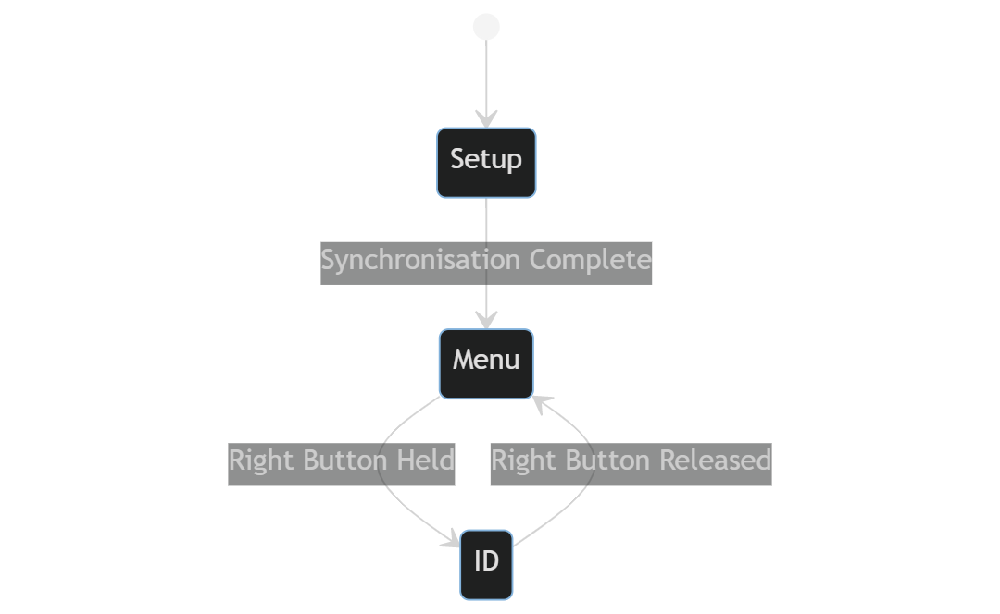
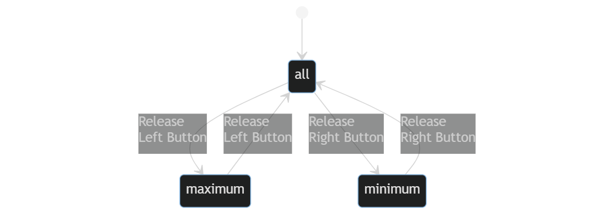
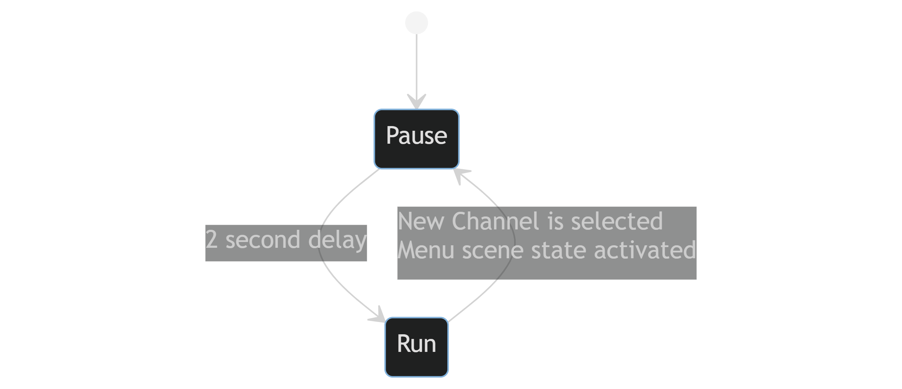

----
## FSMs
#### Scene

This finite state machine controls what scene is visible on the LCD panel as well as the requirements to switch between the states. The states are:

- Setup - This scene is active while the program is synchronising with the host machine. On transition to this state it:
	- Starts the Serial and LCD connections
	- Sets the Backlight to Purple
	- Synchronises
- Menu - Shows the channel information including value, average and description. On transition to this state it:
	- Sets the Backlight to White
	- Resets the description scrollers
	- Renders the scene
- ID - Displays the student ID and free memory on the LCD screen. On transition to this state it:
	-  Sets the Backlight to Purple
	- Renders the scene of both student ID and memory.

There is not and end state as you can not quit the program gracefully.

#### PredicateState

PredicateState is designed to manage the `HCI` extension, determining which subset of channels are to be shown. On teh transition to these states, they: update the screen to only show the correct channels.

- all - Shows all channels that have been sent to the Arduino.
- Maximum - Only shows the channels where the current value is greater than the maximum.
- Minimum - Only shows the channels where the current value is greater than the minimum.

#### Scroller

The scroller states are using in the extension `SCROLL` to move the description along if it is larger than the LCD screen (See the `SCROLL` extension for more). The states are:

- Pause - The description is not moving and has not been scrolled forwards at all. On transition to this state it:
	- Resets the offset into the description, so it starts from the of the text.
- Run - The description is now moving at 2 characters per second by shifting an offset. On transition to this state it:
	- Starts timing every 500ms to implement the scrolling.

## Data structures
The data structures described below will be preceded with the class definition and method declarations to aid in describing their use within the program. It is also worth mentioning that a fair few of the structures overload the assignment operator to ensure if state is changed, certain procedures are always invoked. This provides the added benefit of eliminating any invalid program states from occurring.

### State
```c++
template<typename T>
struct State {
	using Type = T;
	State(const Type state);
	operator Type() const;
	State& operator=(const Type state);
protected:
	Type value;
};
```
template struct `State` lays the ground work for the different FSMs in the program. The current state is stored in `value` and can be of any type. The `using` declaration provides subclasses a way to access the template parameter which is especially important in providing an override to the assignment method. This method enforces that when the state is changed, code can act upon that. This method is specialised for the different template parameters. Finally, there is an implicit type casting for the `State` to be cast back to the original underlying type, reducing bloat.

There are 3 uses of the `State` class template 2 of which are in extensions `HCI` and `SCROLL`.

#### State\<Scene\>
```c++
enum class Scene {
	Setup,
	Menu,
	ID
};
template<> State<Scene>& State<Scene>::operator=(const Type state);
State<Scene> state{ Scene::Setup };
```
`State<Scene>` is merely a template specialisation of the State template class designed to manage the state of the LCD screen. As a global variable, `state` dictates how the program context switches between the 3 enum states.

1. As the program must start in `Setup` and will never return to it, the program uses an assertion to abort the program if that ever occurs.
2. When the state is switched between `ID` and `Menu` sets the backlight colour for the scene as well as rendering the text for the scene.

### Timer
```c++
struct Timer {
	Timer(const uint16_t interval);
	bool active();
	void reset();
private:
	uint16_t interval;
	decltype(millis()) time;
};
```
The `Timer` struct can track the time passed since object initialisation or the last timer reset. The `active` method will return `true` when a variable amount of milliseconds has passed, set by the `interval` member. The `Timer` tracks the time passed independently of how often the `active` method is called.

This is used in 3 distinct places within the code:

1. In `setup`, for synchronisation, where it repeatedly sends *`'Q'`* over the serial bus once the program starts.
2. `Window::Menu::selector` which triggers once the `SELECT` key has been held down for over a second. This method uses the `reset` method such that the timer starts over if `SELECT` is not actively held down.
3. `Scroller::timer` has a duel purpose depending on the current state of the scroller. As outlined in the FSM section, the scroller may be paused or running.
	- While paused, the timer is set for 2 seconds so the description does not move until 2 seconds have passed.
	- Once it has switched to running, the interval is reduced to 500ms so that the description is moved at 2 characters per second. `active` is checked every frame of rendering.

### Event
```c++
struct Event {
	enum Flag {
		None = 0b0,
		Head = 0b1,
		Value = 0b10,
		Description = 0b100,
		All = Head | Value | Description
	};
	bool any();
	bool all();
	bool head();
	bool value();
	bool description();
protected:
	Flag flags;
};
```
An `Event` is used to indicate which components of a channel need rendering in the `Scene::Menu` state. For example, when the value of a channel is changed through the `VF127` command, it wastes time to re-render the entire frame. Instead, an event marked with `Flag::Value` is assigned to the `F` channel. This will tell the renderer to only update a small section of the screen. As an event is a bitmask, multiple events can be set at the same time and all will processed in 1 renderpass.

| Head |  Value  | Description |
| ---: | :-----: | :---------- |
|  \^B | 127,205 | Secondary   |

The table above indicates which bits in the event correlate to the portion of the screen that will be rendered.

The reason for this implementation was to reduce the average frame time, increasing the responsiveness of the buttons. It does have the negative effect of making a full screen render marginally slower^[Because of moving the cursor between each rendering segment. See `Window::Render` for more details] but I believe that trade-off is worth it.

### Channel::View
```c++
union View {
	struct AttrHelper { uint8_t index() const; }
	struct Value : protected AttrHelper;
	struct Description : protected AttrHelper;
	template<uint8_t Pos> struct Boundary : protected AttrHelper;

	uint8_t index;
	Value value;
	Description desc;
	Boundary<eeprom::offset::min> min;
	Boundary<eeprom::offset::max> max;

	bool valid();
	bool exists();
};
```
`View` represents a single channel, however as the name implies, it does not own any of the memory it is representing. The non-owning attributes are embedded in custom data types which perform a lookup when the value is needed, all of which inherit from the `AttrHelper`. `desc`, `min`, and `max` use the eeprom to store there values; the `value` interfaces with the `history` system to retrive its value.

#### Custom Attributes
```c++
struct Example : protected AttrHelper {
	inline operator const uint8_t() const;
	inline Boundary& operator=(const uint8_t rhs);
};
```
This `Example` attribute is the interface used to mimic a normal attribute. It implements a getter and a setter and holds no member variables of it's own. They can have extra methods, such as `Value::avg` which finds the average value of the channel.

#### AttrHelper
```c++
struct AttrHelper {
	INLINE constexpr uint8_t index() const
		{ return reinterpret_cast<const View*>(this)->index; }
};
```
`AttrHelper` implements a single method to let subclasses access the channel index of the `View` it is contained within. It works by assuming this subclass is the first element in the `View` data structure. This is a rather dodgy way give all the subclasses access to the parent class and is very error prone, but works given the circumstances. The reason it can assume it's the first attribute in the data structure is due to the `union`.

All of this allows for code such as: `channel_view.desc = "Chnl C";` and this will immediately be sent to eeprom.

#### Union
The `C++` standard specifies that an empty structure must have a size greater than 0 such that different objects have different memory addresses.^[<https://www.stroustrup.com/bs_faq2.html#sizeof-empty>] This means that all of the custom attributes would be at a different location and therefore `AttrHelper` would not function. To circumvent this, placing all the attributes in a union squashes the members onto each other, which provides two main benefits:

- `View` takes up less space in memory saving on SRAM usage.
- `AttrHelper` is now a viable solution.

### Window::Display
```c++
struct Display {
	uint8_t row;
	View channel;
	Event events;
	Scroller scroll;

	static Display* active(const View channel);
	void reset() { events = Event::Flag::None; }
	void event(const Event::Flag event) { events = events | event; }

};
```
`Window::Display` represents a channel on the LCD screen and only the channels that are on the screen. The `active` static method returns a pointer to a `Display` if that channel is currently on the screen else it returns a nullptr. This can be used by other parts of the program to request that parts of the screen be rendered. The member variables usage is seen below:

| Member Variable | Usage                                             |
| --------------- | ------------------------------------------------- |
| `row`           | The row on the LCD screen where 0 is the top row. |
| `channel`       | The channel it is representing.                   |
| `events`        | Which parts of the screen need rendering.         |
| `scroll`        | The state of the description being scrolled.      |

### Window::Render
`Window::Render` handles rendering the individual segments of the screen, given a certain `Window::Channel`.
```c++
struct Render {
	static void head(Display& display, const uint8_t arrow) {
		lcd.setCursor(0, display.row);
		lcd.write(arrow);
		lcd.write(display.channel.letter());
	}
	static void value(Display& display);
	static void description(Display& display);
	static void layout(Display& display);
protected:
	static void single_value(const uint8_t val) {
		// Right aligns the value by computing log10 of the value
		// log10 will return number of digits - 1
		const uint8_t spaces = 2 - static_cast<uint8_t>(log10(val));
		for (uint8_t i = 0; i < spaces; ++i) {
			lcd.write(' ');
		}
		lcd.print(val);
	}
};
```
Here, the `head` method demonstrates how a segment is rendered. By moving the LCD cursor to the required location before writing the data to the LCD. Furthermore, `single_value` right justifies the number padded with spaces. It uses the log10 of the value to get it's length so it knows how much padding to add.

### Window::ID
```c++
struct ID {
	void begin() { Backlight = Backlight::Colour::PURPLE; ... }
	void poll_input();
	void render();
} id;
```
`Window::ID` is the entry point the the ID scene and therefore a singleton object. It has the transition code in `begin` for when this scene state is activated and this includes changing the backlight colour to match the specification. `poll_input` checks if the user has released the right button and thus needs to switch states again. Finally, `render` prints the student ID number and free memory onto the screen.

### Window::Menu
This class is the entry point of the Menu scene which stores the `Window::Display`s for the LCD.. Just like the `Window::ID` class, it has the `begin`, `render`, and `poll_input` which have similar functionality as well as being a singleton. The member attributes are:

| Member Attributes          | Usage                                            |
| -------------------------- | ------------------------------------------------ |
| `Timer selector{1000}`     | Timer for switching between Menu and ID scenes.  |
| `Display channels[2]`      | Channel Displays for the active rows on the LCD. |
| `uint8_t last_input`       | The previous state of the button inputs.         |
| `PredicateState predicate` | See HCI for usage.                               |

#### Finding the Next Index
For the `Menu` to display a set of channels, it first needs to decide which ones are active. It does this using the `evaluate_index` method to find up to 2 suitable channels. There are 4 different ways it can find these determined by which `Direction` it is meant to be traveling.

##### Direction
```c++
enum Direction : uint8_t {
	Up, Constant, Down, Predicate
};
```
The direction enum is used for determining which way the index should move and how it should be updated. `Up` and `Down` are used when there is user input on the buttons. `Constant` means the top channel should stay the same, while the lower will become whatever is channel is directly after the top. `Predicate` will be discussed in `HCI`.

##### evalutate_index
```c++
bool evaluate_index(const Direction dir);
```
As an example: for any direction given, if there is nothing selected on the top channel, it will pick the first channel which has been created (exists in the eeprom) and then go on to follow the `Direction` command. If given the `Direction::CONSTANT`, it will then select the next avalible channel after the top channel. To select an available channel, the program uses `find_up` and  `find_down` which finds the channel index:

##### Find
```c++
const uint8_t find_down(uint8_t idx);
```
`find_up` and `find_down` are almost identical and so I will only mention `find_down`. When given the index of a channel, it will find the next channel that exists (in the eeprom) that also succeeds the `predicate` check (used in the `HCI` extension).

### Protocol
The protocol manages communication over the serial bus as well as decoding those messages to propagate to the rest of the system.

#### Serial Reading

There are two low level functions for reading data from the serial bus which allow reading a buffer of a certain length and flush the buffer up until a new line. This is very similar to the built-in `Serial.readBytesUntil` however I needed the extra functionality of removing everything left in the Serial buffer if it contains more data than expected. For example, to read the description, it will try read 16 bytes and the newline, but if 20 bytes are sent, I need the extra to be flushed and ignored. This functionality is encapsulated within `read` and `readline`.

```c++
inline Channel::View read_data(char* buffer, const uint8_t size);
```
Beyond this, `read_data` decodes a single line of data of a requested size. The buffer is filled with data from `readline`. It is modified by swapping out the first character of the array, with the length of the string read from the buffer. This is because it may not be the same as the maximum size. The swapped out value is the channel letter which is used to return a `Channel::View`. This function really returns 3 pieces of data at once:
- The Channel
- The Length of the data
- The data

#### Processing
```c++
void process() { if (Serial.available()) {
	bool result = false;
	char buf[cexpr::protocol]{ '\0' };
	const char cmd = Serial.read();
	switch (cmd) {
		case OP::NOOP:		return;
		case OP::CREATE:	result = create(buf); break;
		case OP::VALUE:		result = write(OP::VALUE, buf); break;
		case OP::MAX:		result = write(OP::MAX, buf); break;
		case OP::MIN:		result = write(OP::MIN, buf); break;
	} ...
} }
```
The entry point for decoding the serial input is `process`, which (if something is in the serial buffer) will convert the operations Create, Value, Min, and Max to the functions `create`, `write(Value)`, `write(Min)`, and `write(Max)` respectively.

`create` will setup the channel in the eeprom if the input is valid and will update the description if the channel already exists. The `write` function decodes a 3 digit number and set it to the relevant attribute on a channel.

#### Protocol::OP
```c++
enum OP {
	Create = 'C',
	Value = 'V',
	Min = 'N',
	Max = 'X',
	NoOp = '\n'
};
```
The OP enum is used when decoding the first character of each line from the Serial buffer to determine what to do with the buffer.

### Cexpr
Short for constant expressions, is a namespace with many constants for the program. The usage of these constants is listed below:

| Constant    |                                                                        Usage | Value                |
| :---------- | ---------------------------------------------------------------------------: | :------------------- |
| baud_rate   |                                                     Serial monitor baud rate | 9600                 |
| lcd_width   |                                                   Width of the LCD in pixels | 16                   |
| lcd_height  |                                                  Height of the LCD in pixels | 2                    |
| ram_size    |                     Maximum size of the SRAM found using RAMSTART and RAMEND | 2048                 |
| memory_cull |                                 Amount of free ram to began culling `RECENT` | 200                  |
| desc        |                                       Length of descriptions, including null | 16                   |
| create      |                                    buffer size needed by the Create protocol | desc - 1             |
| write       |                                     buffer size needed by the Write protocol | 3                    |
| protocol    |                       largest buffer needed by the protocols and the channel | max(desc, write) + 1 |
| channels    |                                                           Number of channels | 26                   |
| history     | Number of values to keep in `RECENT` per channel including the current value | 64                   |

### Backlight
```c++
struct Backlight {
	enum Colour;
	Backlight& operator=(const Colour);
	Backlight& operator=(const Backlight&) = delete;
} Backlight;
```
`Backlight` is a singleton structure that will set the LCD backlight colour upon assignment of a colour to the instance. The copy assignment operator is explicitly deleted as copying singleton is nonsensical. Furthermore, a simple assignment overload is added so that a colour can be assigned to the backlight.

#### Colour
The `Colour` enum is lists the available colours for the LCD backlight with the values matching those required by the backlight. This is so they can be used in bitwise operations to merge colours together.

## Debugging
To aid with debugging, I wrote 3 macros which were guarded by a define *"DEBUG"* so that I could easily switch between debug and release builds. They used a GCC magic constant^[<https://gcc.gnu.org/onlinedocs/gcc/Function-Names.html>], namely `__PRETTY_FUNCTION__` and the standard `__LINE__` macro to provide extra detail in the logging. It was important to disable these debug macros to confirm the true memory usage of the program, as the magic constants are long strings unable to be placed in the program memory. The debug macros are `log_debug` and `log_ddebug` in which the latter allows for key value pairs and is a workaround the pre-processor not supporting overloading. There is also an `assert` macro as using the standard library version found in `<assert.h>` would violate the requirements of the project. It simply checks the condition and will output a message before aborting the program if the assertion fails.

## Reflection
The main problem my code suffers from is performance. While the screen is being rendered it is unable to take input from the buttons which makes the program seem rather unresponsive. To improve upon this issue, I would split up rendering over multiple frames to reduce the interval between input polling to hopefully solve the issue. Thankfully, due to the event system, splitting up the rendering process has already been implemented and therefore spreading it over multiple frames could be simple to add.

I would also like to improve the eeprom detection code responsible for seeing if the data in the eeprom is my own. Currently it is very susceptible to being messed with. The current system only has coverage over 6% of the used eeprom which is admittedly really poor and definitely needs improvement. I believe I could use hamming codes to find changes in the eeprom for each channel block. I would not have to add error correction as once the eeprom is edited, the program can assume either nothing is valid, or that channel is now invalid and no longer exists. I think either would be appropriate for this project.

Other than these issues, I am happy with the rest of the program and particularly pleased with the total memory usage of the program at only 526 bytes (25%).

## UDCHARS
```c++
struct Picture {
	const uint8_t pos;
	const byte* const img;
	Picture(const uint8_t pos, const byte* const img);
	void upload() {
		byte buf[8];
		memcpy_P(buf, img, sizeof(buf));
		lcd.createChar(pos, buf);
	}
	operator uint8_t() const { return pos; }
};
// Instantiate picture object from raw data array
#define PICTURE(name, pos, image) \
const ::byte __img_ ## name ## _ ## pos ## __ [8] PROGMEM = BRACED_INIT_LIST image; \
::Picture name {pos, __img_ ## name ## _ ## pos ## __ }
```
User defined characters on the LCD have 2 components: The identifier (`pos`) used during `lcd.write`; the buffer of memory defining the character. The `PICTURE` macro serves 2 purposes and is used as such.
```c++
 PICTURE(UP, 0, (B00000, B00100, B01110, B10101, B00100, B00100, B00100, B00000));
 ```

1. Creates a bytes array with a mangled name (to prevent collisions) that is placed into program memory. `const ::byte __img_UP_0__[8] PROGMEM = {B00000, ..., B00000};`
2. It then instantiates the `Picture` object with the pointer to that buffer. `::Picture UP {0, __img_UP_0__};`

`Picture` assumes the pointer to the buffer is located in program memory, so while uploading the image to the LCD, it must be copied out of the program memory first. The specialised `memcpy_P` achieves this transfer. Unfortunately, `Picture` is not RAII compliant as `lcd.createChar` must succeed the call to `lcd.begin`. Therefore there is a separate `upload` method. Finally, the `Picture` can be implicitly casted back to its identifier to allow for: `lcd.write(UP)`, a clear syntax.

## FREERAM
```c++
void Window::ID::render() {
	...
	auto ram = free_memory();
	lcd.print(ram);
	lcd.write('B');
}
```
Inside the `Window::ID::render` method, the free ram is given from the `free_memory` function (taken from the lab task).

The reason for storing the current memory usage, is so they scene only needs to be rendered if usage has changed from last frame.

The `free_memory` function does have a flaw however. It is only a crude estimate on the unallocated memory in the system for two reasons:
1. By using the the stack pointer, it will give different memory usage results depending on how far down a call stack it is executed.
2. It is using the top of the heap, ignoring any space left in the heap from deallocations. If 3 blocks of memory A, B, and C are allocated (in order) and both A and B are deallocated, `free_memory` acts as if they are still being used.

So `free_memory` can really only give an estimate for the amount of contiguous memory available in the system. I am able to mitigate this ambiguity by only allowing a single memory allocation^[See `RECENT` extension for more] in the program which makes memory management very simple.

## HCI
The `HCI` extension implements a new finite state machine as well as the idea of a predicate function. `HCI` requires 3 new states to represent the normal menu, only channels below the minimum, and only channels beyond the maximum.
```c++
struct Predicate {
	using Func = bool(*)(const Channel::View channel);
	static bool all(const Channel::View) { return true; }
	static bool minimum(const Channel::View channel);
	static bool maximum(const Channel::View channel);
};
struct PredicateState : public State<Predicate::Func> {
	using State::State; // Inherit Constructor
	PredicateState& operator=(const Type state);
} predicate{ Predicate::all };
```
The new state machine is made like so, using the `Predicate` function pointers as the states of the machine. Due to the parent class' design, it allows the function representing the state to be called like: `predicate(channel_view);`.

As noted in `Window::Menu` - `Finding the Next Index`, `find_up` and `find_down` will use this state when finding an available channel. Introducing this predicate function means I can change what "available" means on the fly.

The last thing that is required for this to function correctly, is to ensure the `evaluate_index` is rerun the moment the predicate state switches. This is done in an overloaded assignment operator and calls `evaluate_index(Direction::PREDICATE)` which is a special direction command to make sure it updates to valid channels.

## EEPROM
The eeprom has been laid out as such with the corresponding size in bytes:

`| PreHead | Channel_A | Channel_B | Channel_C | ... | Channel_Z |`

| Segment        | Size (Bytes) |
| -------------- | ------------ |
| PreHead        | 2            |
| Channel_*      | 18           |
| Channels [A-Z] | 468          |
| Total          | 470          |

Which uses around 45% of the eeprom's maximum storage. This means that the program could support up to 56 channels if necessary.

### Channel
Each channel in the eeprom is laid out like so, with the size in bytes:

`| Header | Min | Max | Description |`

| Segment     | Size (Bytes) |
| ----------- | ------------ |
| Header      | 1            |
| Min         | 1            |
| Max         | 1            |
| Description | 15           |

The `Header` indicates if the channel has been set by the program and if this block is being used. The `Header` is set to an arbitrary constant: 137, when the channel is set. `Min` and `Max` are the boundaries for the channel's value and the description is the character array. It is 15 bytes long, as when read from the eeprom, a null character is added implicitly at the end. This saves on space in the eeprom as well as unnecessary writes which increases its lifespan.

```c++
// Position in the eeprom of the start of a channel
INLINE static constexpr uint16_t Channel::eeprom::pos(const uint8_t index) {
	return offset::precheck + size::precheck + static_cast<uint16_t>(index) * size::all;
}
// Is the channel in the eeprom
static const bool Channel::eeprom::available(const uint8_t index) {
	return EEPROM.read(pos(index) + offset::header) == magic;
}
```
The code above demonstrates how a value is read out of the eeprom. `avalible` returns if the channel at the specified `index` has been set. It uses the `pos` method to find the beginning of the chunk.

### Prehead
The prehead segment of the eeprom allows the program to detect if the eeprom values were written by this program or another. It consists of two bytes that both must be equal to the arbitrary constant of 137.

If either are not set, the eeprom then undergoes a setup phase. It enables the prehead segment as well as invalidating every channel block by ensuring the `Header` value is not equal to the magic constant (137). It will only write to the eeprom if it absolutely necessary.

## RECENT
By implementing the EEPROM extension, I moved all the channel data out of the SRAM, increasing the available memory for the RECENT extension. I decided to implement the RECENT extension using a FIFO queue to track the order in which values were input to the system.

The requirements of this extension were impossible as there is not enough memory on the Arduino to store 64 1-byte values for 26 channels which uses 1664 bytes (81.25%). A simple script containing only:

```c++
void setup() {
	Serial.begin(9600);
	lcd.begin(16, 2);
}
```

uses 440 bytes (21.5%) which means it can not be implemented without a compromise.

My compromise takes a dynamic approach allowing for all 26 channels to be used while still allowing the 64 most recent values to be store for multiple channels all dependant on the remaining free memory. The program has around 1300 bytes^[The amount of memory is not explicitly defined as `History` will consume all memory available to the system (minus a small safety buffer) so 1300 is a conservative estimate.] of free ram (including a runtime overhead), all of which can be used by the `History` class. Each `Transaction` in the queue uses 2 bytes and this sets the limitations of my approach to 650 recent transaction in the queue. Therefore it can support anywhere between 10 channels with 64 recent values to 26 channels with 25 recent values. It should be noted that the number of recent values per channel varies (although capped below 64) so the program could end up in a state with 4 channels using all 64, 2 channels using 24, 3 channels using 47, and 205 unallocated transactions. Once all the transactions are allocated and a new value is sent over the serial bus, the oldest transaction is deleted and therefore this new space can be used.

This dynamic approach should be able to cater to most use cases, however it does come with it's own set of drawbacks. The implementation requires each transaction to use 2 bytes^[The channel index and the value. See `Transaction` for more] which reduces the overall number of recent values this system can store by a factor of 2.

### History
```c++
struct History {
	struct Transaction { // A single record
		uint8_t index; // Channel Index
		uint8_t value;
	};
	uint16_t count; // Length of the queue
	Transaction* queue;

	// Appends a new transaction to the queue and culls the queue if necessary
	void append(const Transaction transaction);
	// Reduce the queue size by 1
	void pop();
	// Reduces the size of the queue until free ram is above an acceptible limit
	void cull();
	// Find the first transaction value belonging to a specfic channel
	uint16_t first(const uint8_t index) const;
	// Calculate the average value for a specific channel
	uint8_t avg(const uint8_t index) const;
} history;
```

Each element in the queue consists of the value and the index of the channel it was inputted to. In memory, the queue is backwards such that `Transaction* queue` is the tail. It has been designed this way because transactions closer to the tail, are the most recent.

The `first` method is necessary to find the current value for a channel, as this information is not stored anywhere and is always queried when needed. Therefore, it iterates through the queue starting from the tail to find current value using a linear search. Similarly, `avg` works in the same way as `first`, but does not stop after the first value.

Methods `append`, `pop`, and `cull` work in tandem to manage the memory usage of the `History` and ensure it does exceed the program memory. Because this system is the only point in the program which allocates memory onto the heap, the `free_memory` function gives an incredibly accurate result of usage.^[No other memory will be freed from the heap, so no gaps of unallocated memory exist. See `FREERAM` for more]

### Queue Lifecycle
#### Append
When a new transaction arrives, it needs to be appended to the queue. Before this, the history is culled to stay within the memory limits if needs be (See `cull`).
Depending on the current state of the queue, 3 things can happen.

1. If there are 64 values in the queue with the same channel index as the new transaction:
	The oldest of the 64 is removed, and the queue shifts forwards accordingly, leaving a spare spot for the new transaction. The queue does not change in size.
1. Else, the queue attempts to expand by 1 but the system rejects the request:
	The oldest transaction in the queue is removed, the queue shifts forwards and the new transaction is appended. The queue does not change in size.
1. Finally, the queue successfully expands by 1:
	Nothing is removed and the new transaction is placed into the queue as the most recent. The queue expands by 2 bytes (1 transaction).

The resizes are implemented by using a `realloc`, and shifting the queue forwards uses `memove` to jump every element by 2 bytes. Using `memove` as opposed to circular queue approach is less performant, but allows for the memory allocation to grow, instead of being fixed at compile time.

#### Pop
```c++
queue = alloc::r(queue, --count);
```
`pop` simply reduces the queue size by 2 bytes and removes the oldest element in the queue. Due to the backwards structure of the queue, by deallocating the memory at the end of the queue, the element is automatically removed.

#### Cull
`cull` will `pop` a single transaction from the queue until the `free_memory` is above the `memory_cull` limit. It is run before an element is appended therefore the memory usage can technically go over the limit, however it will only ever be by 2 bytes.

### Alloc
Namespace `alloc` wraps simple memory allocations with the `c++` template system. Where `alloc::r<T>(ptr, count)` is equivalent to `reinterpret_cast<T*>(realloc(ptr, count * sizeof(T)))`. `alloc` implements:
- malloc
- realloc
- memcpy
- memmove

They are guaranteed to incur no runtime overhead as I have used the gcc function attribute `always_inline`^[<https://gcc.gnu.org/onlinedocs/gcc-4.1.2/gcc/Function-Attributes.html>] to make sure it is inlined.

## NAMES
The description, like everything else, is stored in the eeprom. Because it is out of memory, when being streamed back in, it is held in a globally shared, temporary 16 byte buffer (includes the null terminator). This would provide limitations such as `channel_a.desc == channel_b.desc` always returns true, as they point to the same buffer of memory. Other than this odd behaviour, the description is a 16 byte character array. To print the description onto the LCD screen, the program simply uses `lcd.print` to do so. This is expanded upon in the `SCROLL` extension.

## SCROLL
Implementing scrolling meant including a new state machine. I decided the description scrolling all the time made it impossible to read when it first appeared. To circumvent this, two states were added: Paused and Running, which as the names imply, dictate if the description is moving or not.
```c++
enum class Scroll {
	Pause,
	Run
};
class Scroller : public State<Scroll> {
public:
	uint8_t pos;
	Timer timer;
	Scroller& operator=(const Type state);
```
A subclass of `State<Scroll>`, Scroller is found in the `Window::Display` as it is needed to render the description. The scroller has: a timer, to control the speed of the scrolling and how long it is paused for; and a position showing how far it has scrolled so far.

The scrolling is used in `Window::Render::description` where it moves the description along by `pos` number of characters and it uses the modulus to wrap it around. It will only do this is the channel description is too long to fit on the LCD screen which is over 10 characters.

The scrolling state is reverted back to `Pause` if the channel is no longer on the screen and therefore a new channel has taken it's place. It also occurs when switching from the `ID` to `Menu` scene.
